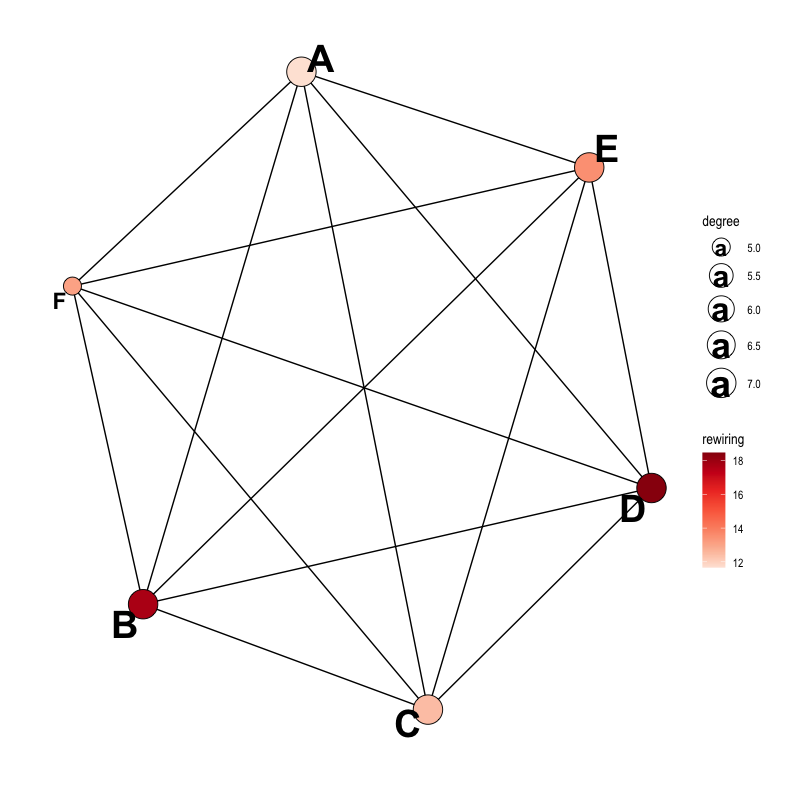
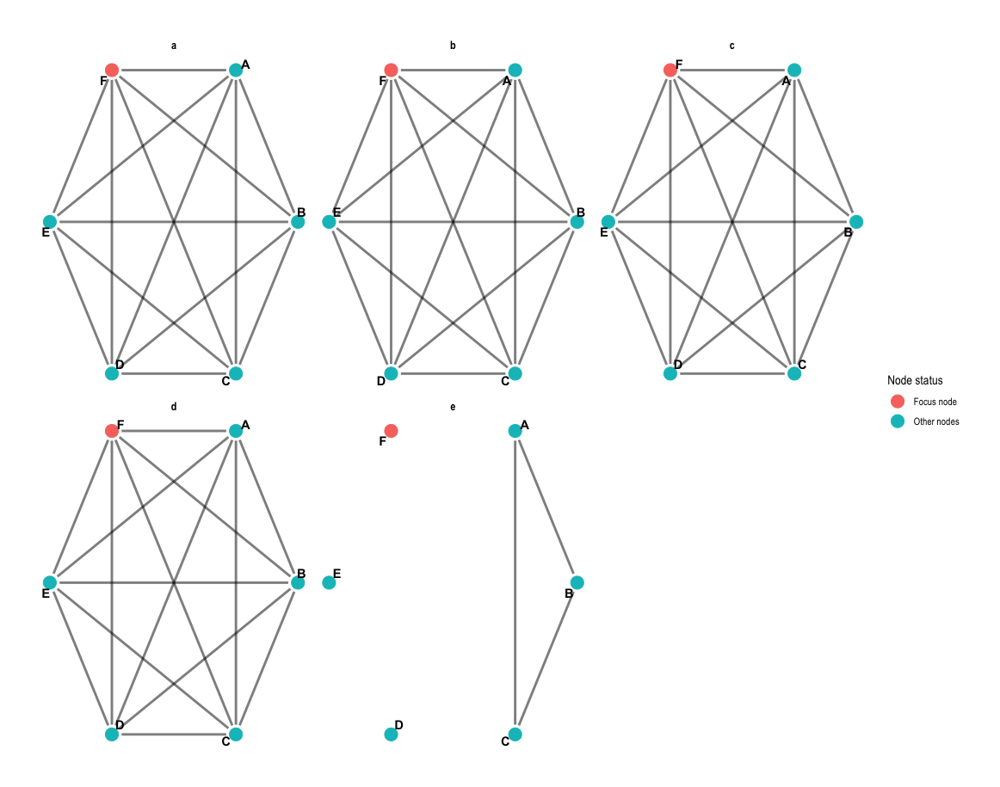
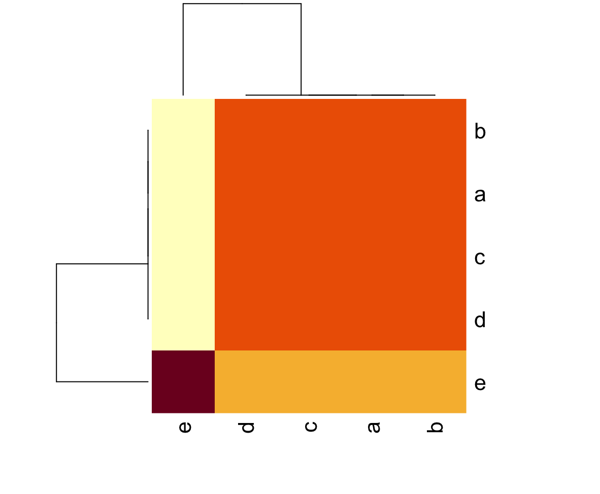
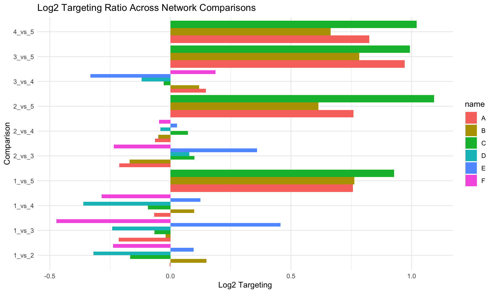

# dynetR
R implementation of the DyNet network rewiring algorithm as described in [Goenawan et al., 2016](https://academic.oup.com/bioinformatics/article/32/17/2713/2450724).

The main function, `dynetR` takes a **named[^1]** list of weighted[^2] edge lists[^3], adjacency matrices[^4], igraph objects or tbl_graph objects (from tidygraph) to calculate rewiring values as described in the paper.

[^1]: Important to help the user keep track of the input networks, especially for the small multiples plot.
[^2]: Please make sure to use positive weights only.
[^3]: Edge lists should follow the igraph convention, i.e. columns titled `from, to, weight`
[^4]: Make sure to name at least the columns of the adj. matrix with the corresponding node names.

To install the package use
```devtools::install_github('olbeimarton/dynetR')```

**Adjacency matrix input example**
```

m1 <- matrix(rnorm(36, mean = 5), nrow = 6,  dimnames = list(c("A", "B","C","D","E","F"),
                                                    c("A", "B","C","D","E","F")))
m2 <- matrix(rnorm(36, mean = 5), nrow = 6,  dimnames = list(c("A", "B","C","D","E","F"),
                                                    c("A", "B","C","D","E","F")))
m3 <- matrix(rnorm(36, mean = 5), nrow = 6,  dimnames = list(c("A", "B","C","D","E","F"),
                                                    c("A", "B","C","D","E","F")))
m4 <- matrix(rnorm(36, mean = 5), nrow = 6,  dimnames = list(c("A", "B","C","D","E","F"),
                                                    c("A", "B","C","D","E","F")))
m5 <- matrix(rnorm(9, mean = 5), nrow = 3,  dimnames = list(c("A", "B","C"), c("A", "B","C")))                                             
mList <- list('a' = m1, 'b' = m2, 'c' = m3, 'd' = m4, 'e' = m5)
```

**Edge list input example**
```
el1 <- data.frame(from = c('0','1','2','3','4'),
                  to = c('1','0','3','4','0'),
                  weight= c(1,1,1,1,1))
el2 <- data.frame(from = c('1','0','2','4','3'),
                  to = c('0','0','2','4','1'),
                  weight= c(1,1,1,1,1))
el3 <- data.frame(from = c('1','2','4','3','0'),
                  to = c('1','0','3','4','0'),
                  weight= c(1,1,1,1,1))


mList1 <- list('a' = el1, 'b' = el2,'c' = el3)
```

**igraph list input example**
```
g1<-barabasi.game(n=5)
g2<-barabasi.game(n=5)
g3<-barabasi.game(n=5)
gList1 <- list('a'=g1,'b'=g2,'c'=g3)
```

**Running dynetR**
 ```
output<-dynetR(mList)
```
The main function, `dynetR`, returns a dataframe with the node rewiring values: 
```
> output
  name rewiring degree degree_corrected_rewiring
1    A 11.66336      7                  1.666195
2    B 17.72024      7                  2.531463
3    C 12.43599      7                  1.776569
4    D 18.47138      7                  2.638768
5    E 13.48869      7                  1.926956
6    F 13.05306      5                  2.610611
```

The output of `dynetR` can be used with the `dynetR_plot` function to visualise a simple plot depicting the union network and the rewiring values.

```dynetR_plot(mList, output)```





**Structural rewiring**

By default, `dynetR` uses the weight values in the adjacency matrix / edge list to calculate rewiring. If you are only interested in rewiring changes caused by topological differences, set the `structure_only` parameter to `TRUE`, which will replace all non-zero values with `1`.

```dynetR(mList, structure_only = T)```

**Small multiples plot**

A typical follow-up analysis usually involves a more in-depth study of the most rewired nodes, to understand why they are rewired. 

The `small_multiples_plot` function returns a small multiples plot, focussing on the interactions of a single node across the compared network states. The function requires two parameters, the input adjacency matrices and the name of the focus node, `F` in this example.

```small_multiples_plot(mList, 'F')```



### Additional network comparison options

**Jaccard-index**

The `calculate_jaccard_indices` function takes the same input list of networks (edgelists, adjacency matrices etc.) as `dynetR` to calculate the Jaccard-index between all compared networks. This is useful for quickly establishing the global similarity of networks.

```
jaccard<-calculate_jaccard_indices(mList)
# results can be visualised in a number of ways, including the built in R heatmap function
heatmap(jaccard)
```


**Differential targeting**

When analysing directed networks, for example gene regulatory networks, it is often interesting to investigate whether certain genes receive more or less regulatory inputs from the available regulators. The `compare_targeting` function returns a long format dataframe containing the targeting values (weighted in-degree) for all nodes in all contrasts, and calculates their absolute differences and log2 ratios.

```compare_targeting(mList)```
```
# A tibble: 48 × 6
   name  compared_networks targetingNet1    targetingNet2    deltaTargeting log2TargetingFC
   <chr> <chr>             <chr>            <chr>                     <dbl>           <dbl>
 1 A     1_vs_2            27.6346392300918 27.6874690512176         0.0528        -0.00276
 2 B     1_vs_2            29.8726112282955 26.9418521610785         2.93           0.149  
 3 C     1_vs_2            28.5670161764824 32.060872844062          3.49          -0.166  
 4 D     1_vs_2            24.2359415913853 30.232862221301          6.00          -0.319  
 5 E     1_vs_2            33.4329853975894 31.2644101654748         2.17           0.0968 
 6 F     1_vs_2            23.9585795470352 28.2588353526615         4.30          -0.238  
 7 A     1_vs_3            27.6346392300918 32.0685564274156         4.43          -0.215  
 8 B     1_vs_3            29.8726112282955 30.3004109595961         0.428         -0.0205 
 9 C     1_vs_3            28.5670161764824 29.9136675030772         1.35          -0.0665 
10 D     1_vs_3            24.2359415913853 28.6473055140799         4.41          -0.241  
# ℹ 38 more rows
# ℹ Use `print(n = ...)` to see more rows
```
The results can be visualised in a number of ways, here's an example using `ggplot2`

```
targeting_example<-compare_targeting(mList)

library(ggplot2)

ggplot(targeting_example, aes(x = compared_networks, y = log2TargetingFC, fill = name )) +
  geom_bar(stat = 'identity', position = 'dodge') +
  coord_flip()+
  labs(title = 'Log2 Targeting Ratio Across Network Comparisons', x = 'Comparison', y = 'Log2 Targeting') +
  theme_minimal()
```


